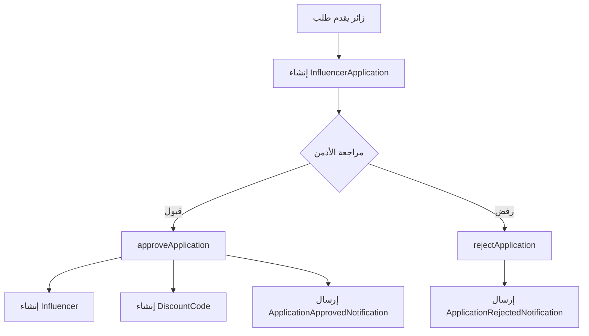
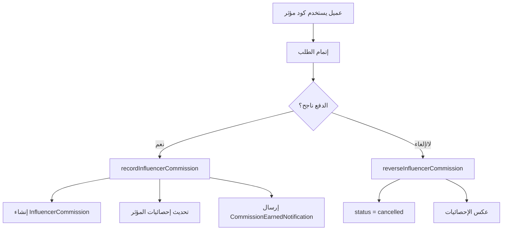
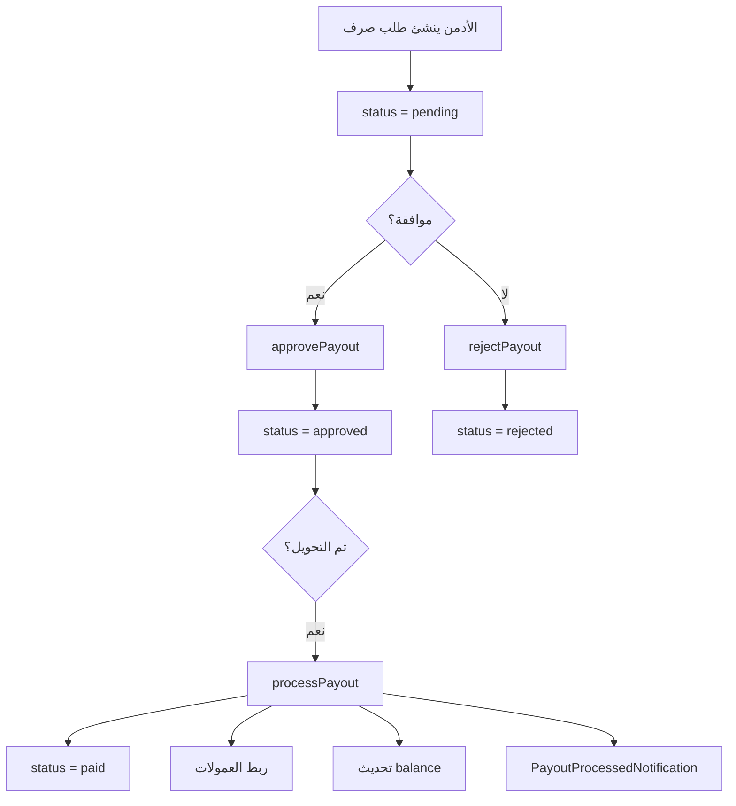

# 📚 دليل نظام المؤثرين الشامل

## الفهرس

1. [نظرة عامة](#نظرة-عامة)
2. [بنية الملفات](#بنية-الملفات)
3. [الـ Models](#الـ-models)
4. [الـ Services](#الـ-services)
5. [Filament Resources](#filament-resources)
6. [تدفق العمليات](#تدفق-العمليات)
7. [الإشعارات](#الإشعارات)
8. [الترجمات](#الترجمات)

---

## نظرة عامة

نظام المؤثرين يتيح:
- تقديم طلبات انضمام كمؤثر
- إدارة طلبات التقديم (قبول/رفض)
- إنشاء أكواد خصم للمؤثرين
- تتبع العمولات من المبيعات
- إدارة طلبات صرف الأرباح

### الجداول الأساسية

| الجدول | الوصف |
|--------|-------|
| `influencer_applications` | طلبات التقديم |
| `influencers` | المؤثرين المقبولين |
| `discount_codes` | أكواد الخصم (مرتبطة بـ influencer_id) |
| `influencer_commissions` | العمولات من الطلبات |
| `commission_payouts` | طلبات صرف الأرباح |

---

## بنية الملفات

```
app/
├── Models/
│   ├── InfluencerApplication.php  ← طلب التقديم
│   ├── Influencer.php             ← المؤثر
│   ├── InfluencerCommission.php   ← العمولة
│   ├── CommissionPayout.php       ← طلب الصرف
│   └── DiscountCode.php           ← كود الخصم
│
├── Services/
│   ├── InfluencerService.php      ← منطق المؤثرين
│   ├── OrderService.php           ← تسجيل العمولات
│   └── CouponService.php          ← التحقق من الأكواد
│
├── Filament/Resources/Influencers/
│   ├── InfluencerApplicationResource.php
│   ├── InfluencerResource.php
│   ├── CommissionPayoutResource.php
│   ├── Schemas/
│   │   ├── ApplicationForm.php
│   │   ├── InfluencerForm.php
│   │   └── PayoutForm.php
│   ├── Tables/
│   │   ├── ApplicationsTable.php
│   │   ├── InfluencersTable.php
│   │   └── PayoutsTable.php
│   └── Pages/
│       ├── ListApplications.php
│       ├── ViewApplication.php
│       ├── ListInfluencers.php
│       ├── ViewInfluencer.php
│       ├── EditInfluencer.php
│       ├── ListPayouts.php
│       ├── CreatePayout.php
│       └── ViewPayout.php
│
└── Notifications/
    ├── ApplicationApprovedNotification.php
    ├── ApplicationRejectedNotification.php
    ├── CommissionEarnedNotification.php
    └── PayoutProcessedNotification.php
```

---

## الـ Models

### InfluencerApplication

```php
// الحقول المهمة
protected $fillable = [
    'user_id',           // NULL إذا تقديم كضيف
    'full_name',
    'email',
    'phone',
    'instagram_url',     // روابط السوشيال ميديا
    'facebook_url',
    'tiktok_url',
    'youtube_url',
    'twitter_url',
    'instagram_followers', // عدد المتابعين
    'facebook_followers',
    'tiktok_followers',
    'youtube_followers',
    'twitter_followers',
    'content_type',      // ['fashion', 'beauty', 'lifestyle', etc.]
    'portfolio',
    'status',            // pending, approved, rejected
    'rejection_reason',
    'reviewed_by',
    'reviewed_at',
];

// العلاقات
public function user(): BelongsTo
public function reviewer(): BelongsTo
```

### Influencer

```php
protected $fillable = [
    'user_id',
    'commission_rate',   // نسبة العمولة الافتراضية
    'status',            // active, suspended
    'total_sales',       // إجمالي المبيعات
    'total_commission_earned',
    'total_commission_paid',
    'balance',           // الرصيد المتاح للسحب
    // بيانات السوشيال ميديا...
];

// العلاقات
public function user(): BelongsTo
public function discountCodes(): HasMany
public function commissions(): HasMany
public function payouts(): HasMany
```

### InfluencerCommission

```php
protected $fillable = [
    'influencer_id',
    'order_id',
    'discount_code_id',
    'order_amount',      // قيمة الطلب
    'commission_rate',   // نسبة العمولة
    'commission_amount', // مبلغ العمولة
    'status',            // pending, paid, cancelled
    'paid_at',
    'payout_id',         // ربط بطلب الصرف
];

// العلاقات
public function influencer(): BelongsTo
public function order(): BelongsTo
public function discountCode(): BelongsTo
public function payout(): BelongsTo
```

### CommissionPayout

```php
protected $fillable = [
    'influencer_id',
    'amount',
    'method',            // bank_transfer, vodafone_cash, instapay
    'bank_details',      // JSON: account_number, bank_name, etc.
    'status',            // pending, approved, rejected, paid
    'rejection_reason',
    'approved_by',
    'approved_at',
    'paid_by',
    'paid_at',
    'transaction_reference',
    'notes',
];

// العلاقات
public function influencer(): BelongsTo
public function approver(): BelongsTo  // المسؤول الذي وافق
public function payer(): BelongsTo     // المسؤول الذي دفع
public function commissions(): HasMany // العمولات المشمولة
```

---

## الـ Services

### InfluencerService

#### الـ Methods الرئيسية

```php
// قبول طلب تقديم
public function approveApplication(
    int $applicationId, 
    float $commissionRate, 
    ?int $reviewedBy = null
): Influencer

// رفض طلب تقديم
public function rejectApplication(
    int $applicationId, 
    string $reason, 
    ?int $reviewedBy = null
): InfluencerApplication

// إنشاء كود خصم
public function createDiscountCode(
    int $influencerId, 
    array $data
): DiscountCode

// تحديث حالة المؤثر
public function updateStatus(int $id, string $status): Influencer

// موافقة على طلب صرف
public function approvePayout(
    int $payoutId, 
    ?int $approvedBy = null
): CommissionPayout

// رفض طلب صرف
public function rejectPayout(
    int $payoutId, 
    string $reason, 
    ?int $rejectedBy = null
): CommissionPayout

// تنفيذ الصرف (وضع علامة مدفوع)
public function processPayout(
    int $payoutId, 
    string $transactionReference, 
    ?int $paidBy = null
): CommissionPayout
```

### OrderService - تكامل العمولات

```php
// تُستدعى تلقائياً عند تغيير payment_status إلى paid
protected function recordInfluencerCommission(Order $order): void
{
    // 1. التحقق من وجود discount_code_id
    // 2. التحقق من أن الكود تابع لمؤثر
    // 3. التحقق من أن المؤثر active
    // 4. التحقق من أن الكود is_active
    // 5. حساب العمولة
    // 6. تسجيل العمولة
    // 7. تحديث إحصائيات المؤثر
}

// تُستدعى تلقائياً عند إلغاء الطلب
protected function reverseInfluencerCommission(Order $order): void
{
    // 1. البحث عن عمولة pending للطلب
    // 2. تغيير status إلى cancelled
    // 3. عكس الإحصائيات من المؤثر
}
```

### CouponService - Edge Cases

```php
// في validateCoupon():
if ($coupon->influencer_id) {
    $influencer = $coupon->influencer;
    
    // مؤثر موقوف = كود غير صالح
    if (!$influencer || $influencer->status === 'suspended') {
        return [
            'valid' => false,
            'error' => __('messages.coupon_errors.influencer_suspended'),
        ];
    }
    
    // مؤثر غير نشط = كود غير صالح
    if ($influencer->status !== 'active') {
        return [
            'valid' => false,
            'error' => __('messages.coupon_errors.invalid'),
        ];
    }
}
```

---

## Filament Resources

### InfluencerApplicationResource

**المسار:** `/admin/influencers/influencer-applications`

**الأعمدة:**
- الاسم الكامل
- البريد الإلكتروني
- الهاتف
- إجمالي المتابعين (محسوب)
- الحالة (badge ملون)
- تاريخ التقديم

**الأكشن:**
- **قبول**: يفتح modal لإدخال commission_rate، يستخدم `DB::transaction`
- **رفض**: يفتح modal لإدخال rejection_reason

### InfluencerResource

**المسار:** `/admin/influencers/influencers`

**الأعمدة:**
- اسم المستخدم
- البريد الإلكتروني
- نسبة العمولة
- إجمالي المبيعات
- الرصيد
- عدد الأكواد
- الحالة

**الأكشن:**
- **تفعيل**: يغير status إلى active
- **تعليق**: يغير status إلى suspended

### CommissionPayoutResource

**المسار:** `/admin/influencers/commission-payouts`

**الأعمدة:**
- المؤثر
- المبلغ
- طريقة الدفع
- الحالة
- رقم المرجع
- التاريخ

**الأكشن:**
- **موافقة**: يغير status إلى approved
- **رفض**: يفتح modal لسبب الرفض
- **تم الدفع**: يفتح modal لرقم المرجع

---

## تدفق العمليات

### 1. تدفق طلب التقديم



### 2. تدفق العمولات



### 3. تدفق طلب الصرف



---

## الإشعارات

### ApplicationApprovedNotification

**يُرسل عند:** قبول طلب التقديم
**القنوات:** Email, Database
**المحتوى:**
- رسالة ترحيب
- كود الخصم الخاص بالمؤثر
- رابط تسجيل الدخول

### ApplicationRejectedNotification

**يُرسل عند:** رفض طلب التقديم
**القنوات:** Email, Database
**المحتوى:**
- رسالة اعتذار
- سبب الرفض
- دعوة للتقديم مستقبلاً

### CommissionEarnedNotification

**يُرسل عند:** تسجيل عمولة جديدة
**القنوات:** Email, Database
**المحتوى:**
- رقم الطلب
- قيمة الطلب
- نسبة العمولة
- مبلغ العمولة

### PayoutProcessedNotification

**يُرسل عند:** تنفيذ طلب صرف
**القنوات:** Email, Database
**المحتوى:**
- المبلغ المحول
- طريقة الدفع
- رقم المرجع
- تاريخ التحويل

---

## الترجمات

### مفاتيح الترجمة الرئيسية

```php
// Navigation
'admin.nav.influencers' => 'المؤثرين'

// Applications
'admin.applications.title' => 'طلبات التقديم'
'admin.applications.statuses.pending' => 'قيد المراجعة'
'admin.applications.statuses.approved' => 'مقبول'
'admin.applications.statuses.rejected' => 'مرفوض'

// Influencers
'admin.influencers.title' => 'المؤثرين'
'admin.influencers.statuses.active' => 'نشط'
'admin.influencers.statuses.suspended' => 'موقوف'

// Payouts
'admin.payouts.title' => 'طلبات الصرف'
'admin.payouts.statuses.pending' => 'قيد الانتظار'
'admin.payouts.statuses.approved' => 'موافق عليه'
'admin.payouts.statuses.rejected' => 'مرفوض'
'admin.payouts.statuses.paid' => 'تم الدفع'
'admin.payouts.methods.bank_transfer' => 'تحويل بنكي'
'admin.payouts.methods.vodafone_cash' => 'فودافون كاش'
'admin.payouts.methods.instapay' => 'إنستاباي'

// Coupon Errors
'messages.coupon_errors.influencer_suspended' => 'هذا الكود غير متاح حالياً'
```

---

## الخطوة التالية

راجع [TESTING_GUIDE.md](./TESTING_GUIDE.md) للاختبار الشامل.
راجع [TROUBLESHOOTING.md](./TROUBLESHOOTING.md) لحل المشاكل.
