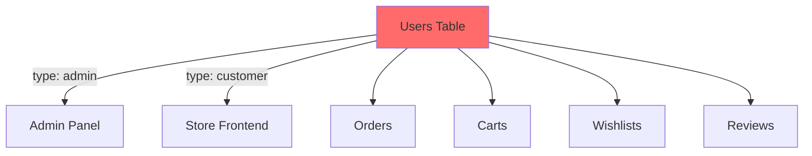
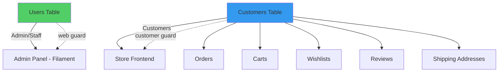
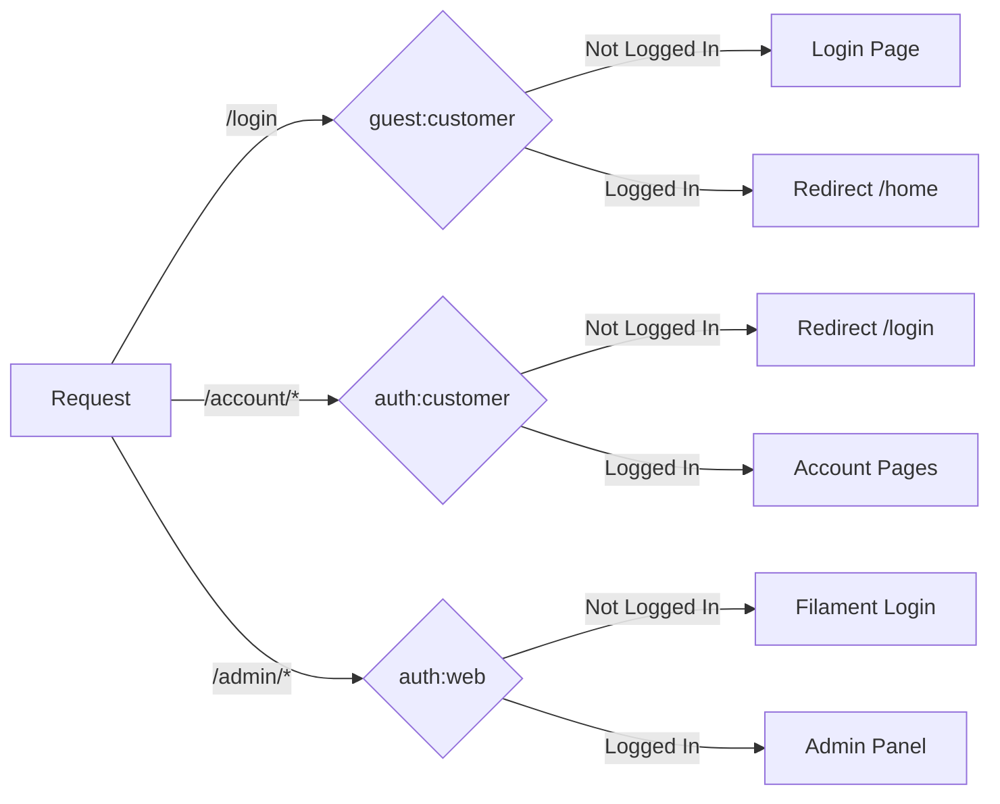

# User/Customer Separation - Technical Documentation
## Violet E-Commerce Platform

**Date:** December 9-11, 2025  
**Version:** 2.0  
**Author:** Development Team  

---

## 📋 Table of Contents

1. [Executive Summary](#executive-summary)
2. [Architecture Overview](#architecture-overview)
3. [Database Schema Changes](#database-schema-changes)
4. [Model Layer Changes](#model-layer-changes)
5. [Authentication System](#authentication-system)
6. [Routes & Middleware](#routes--middleware)
7. [Services Layer](#services-layer)
8. [Livewire Components](#livewire-components)
9. [Controllers](#controllers)
10. [Testing & Verification](#testing--verification)
11. [Migration Guide](#migration-guide)

---

## 1. Executive Summary

### 🎯 Objective
Complete separation of **Customers** (frontend users) and **Users** (admin/staff) into distinct database tables with separate authentication guards and dedicated models.

### 🔑 Key Changes
- ✅ New `customers` table with dedicated authentication
- ✅ Migrated all customer data from `users` to `customers`
- ✅ Updated foreign keys across 7+ related tables
- ✅ Implemented `customer` authentication guard
- ✅ Updated 30+ files across Models, Services, Components, and Routes

### 📊 Impact Summary

| Category | Files Modified | Files Created |
|----------|---------------|---------------|
| Database Migrations | 0 | 4 |
| Models | 7 | 1 (Customer.php) |
| Services | 3 | 0 |
| Livewire Components | 7 | 0 |
| Auth Pages | 3 | 0 |
| Controllers | 1 | 0 |
| Routes | 2 | 0 |
| Listeners | 1 | 0 |
| **Total** | **24** | **5** |

---

## 2. Architecture Overview

### Previous Architecture (🔴 Old)



**Problems:**
- Mixed user types in single table
- Single authentication guard for all users
- Difficult to manage separate permissions
- Customer data mixed with staff data

### New Architecture (🟢 New)



**Benefits:**
- ✅ Clear separation of concerns
- ✅ Isolated authentication systems
- ✅ Better security and permissions
- ✅ Easier to manage and scale

---

## 3. Database Schema Changes

### 3.1 New Tables Created

#### `customers` Table
```sql
CREATE TABLE `customers` (
  `id` BIGINT UNSIGNED PRIMARY KEY AUTO_INCREMENT,
  `name` VARCHAR(255) NOT NULL,
  `email` VARCHAR(255) UNIQUE NOT NULL,
  `phone` VARCHAR(20) NULL,
  `password` VARCHAR(255) NOT NULL,
  `email_verified_at` TIMESTAMP NULL,
  `status` ENUM('active', 'inactive', 'blocked') DEFAULT 'active',
  `total_orders` INT DEFAULT 0,
  `total_spent` DECIMAL(10,2) DEFAULT 0.00,
  `remember_token` VARCHAR(100) NULL,
  `created_at` TIMESTAMP NULL,
  `updated_at` TIMESTAMP NULL
);
```

#### `customer_password_reset_tokens` Table
```sql
CREATE TABLE `customer_password_reset_tokens` (
  `email` VARCHAR(255) PRIMARY KEY,
  `token` VARCHAR(255) NOT NULL,
  `created_at` TIMESTAMP NULL
);
```

### 3.2 Modified Tables

#### Tables with `customer_id` Foreign Key Added

| Table | Old Column | New Column | Migration Strategy |
|-------|-----------|------------|-------------------|
| `orders` | `user_id` (nullable) | `customer_id` (nullable) | Keep both, migrate data, then cleanup |
| `carts` | `user_id` (nullable) | `customer_id` (nullable) | Replaced `user_id` |
| `wishlists` | `user_id` | `customer_id` | Replaced `user_id` |
| `product_reviews` | `user_id` | `customer_id` | Replaced `user_id` |
| `shipping_addresses` | `user_id` | `customer_id` | Replaced `user_id` |

#### `users` Table Changes
- ❌ Removed `type` column (was: `admin`, `customer`, `influencer`)
- ❌ Deleted all customer records
- ✅ Now contains only admin/staff users

### 3.3 Migrations Overview

#### Migration 1: `2025_12_09_160100_create_customers_table.php`
**Purpose:** Create customers and password reset tables

```php
Schema::create('customers', function (Blueprint $table) {
    $table->id();
    $table->string('name');
    $table->string('email')->unique();
    $table->string('phone', 20)->nullable();
    $table->string('password');
    $table->timestamp('email_verified_at')->nullable();
    $table->enum('status', ['active', 'inactive', 'blocked'])->default('active');
    $table->integer('total_orders')->default(0);
    $table->decimal('total_spent', 10, 2)->default(0);
    $table->rememberToken();
    $table->timestamps();
});
```

#### Migration 2: `2025_12_09_160200_migrate_customers_data.php`
**Purpose:** Copy customer data from users to customers table

**Key Operations:**
1. Copy all users with `type = 'customer'` to `customers` table
2. Preserve original IDs for data integrity
3. Calculate `total_orders` and `total_spent` statistics
4. Set `email_verified_at` from original records

```php
DB::statement("
    INSERT INTO customers (id, name, email, phone, password, email_verified_at, status, created_at, updated_at)
    SELECT id, name, email, phone, password, email_verified_at, 'active', created_at, updated_at
    FROM users WHERE type = 'customer'
");
```

#### Migration 3: `2025_12_09_160300_add_customer_id_to_related_tables.php`
**Purpose:** Add `customer_id` foreign keys to related tables

**Tables Updated:**
- ✅ `orders` - Added `customer_id`, migrated data from `user_id`
- ✅ `carts` - Added `customer_id`, migrated data from `user_id`
- ✅ `wishlists` - Added `customer_id`, migrated data from `user_id`
- ✅ `product_reviews` - Added `customer_id`, migrated data from `user_id`
- ✅ `shipping_addresses` - Added `customer_id`, migrated data from `user_id`

```php
// Example for orders table
Schema::table('orders', function (Blueprint $table) {
    $table->foreignId('customer_id')->nullable()->after('user_id')
          ->constrained('customers')->nullOnDelete();
});

DB::statement('UPDATE orders SET customer_id = user_id WHERE user_id IN (SELECT id FROM customers)');
```

#### Migration 4: `2025_12_09_160400_cleanup_users_table.php`
**Purpose:** Clean up and remove redundant columns

**Operations:**
1. Delete customer records from `users` table
2. Drop `type` column from `users` table
3. Drop `user_id` column from customer-only tables (carts, wishlists, etc.)
4. Add unique constraint on `customer_id + product_id` for wishlists

**Special Handling:**
- Uses `information_schema` to check column existence
- Drops all indexes before dropping columns
- Wrapped in try-catch for edge cases

```php
private function dropColumnIfExists(string $tableName, string $columnName): void
{
    if (!$this->columnExists($tableName, $columnName)) {
        return;
    }

    // Drop indexes using this column
    $this->dropIndexesUsingColumn($tableName, $columnName);
    
    // Drop foreign key
    $this->dropForeignKeyIfExists($tableName, $tableName . '_' . $columnName . '_foreign');
    
    // Drop column (with try-catch for edge cases)
    try {
        DB::statement("ALTER TABLE `{$tableName}` DROP COLUMN `{$columnName}`");
    } catch (\Exception $e) {
        // Column might already be dropped
    }
}
```

---

## 4. Model Layer Changes

### 4.1 New Model: `Customer.php`

**Location:** `app/Models/Customer.php`

**Purpose:** Represent customer entities with authentication capabilities

**Key Features:**
- 🔐 Implements `Authenticatable` contract
- 🔑 Uses `HasFactory`, `Notifiable`, `HasApiTokens` traits
- 📊 Tracks statistics (`total_orders`, `total_spent`)
- 🔗 Relations to orders, carts, wishlists, reviews, addresses

```php
class Customer extends Authenticatable
{
    use HasFactory, Notifiable, HasApiTokens;

    protected $guard = 'customer';

    protected $fillable = [
        'name', 'email', 'phone', 'password', 
        'email_verified_at', 'status',
        'total_orders', 'total_spent',
    ];

    protected $hidden = ['password', 'remember_token'];

    protected $casts = [
        'email_verified_at' => 'datetime',
        'password' => 'hashed',
        'total_spent' => 'decimal:2',
    ];

    // Relations
    public function orders() { return $this->hasMany(Order::class); }
    public function carts() { return $this->hasMany(Cart::class); }
    public function wishlists() { return $this->hasMany(Wishlist::class); }
    public function reviews() { return $this->hasMany(ProductReview::class); }
    public function shippingAddresses() { return $this->hasMany(ShippingAddress::class); }
}
```

### 4.2 Updated Models

#### `User.php` (Simplified)
**Changes:**
- ❌ Removed `type` column from `$fillable`
- ❌ Removed customer-related scopes (`scopeCustomers`, `scopeInfluencers`)
- ❌ Removed customer relations (`orders`, `carts`, `wishlists`)
- ✅ Now exclusively for admin/staff users
- ✅ Updated `canAccessPanel()` to not check for type

```php
class User extends Authenticatable
{
    // Removed from fillable
    protected $fillable = [
        'name', 'email', 'password', 'phone', 
        'profile_photo_path', 'status', 'locale',
        // 'type' - REMOVED
    ];

    // canAccessPanel updated
    public function canAccessPanel(Panel $panel): bool
    {
        return $this->hasAnyRole(['super-admin', 'admin', 'manager', 'editor']);
    }
}
```

#### `Order.php`
**Changes:**
- ✅ Added `customer_id` to `$fillable`
- ✅ Added `customer()` relation
- ✅ Added customer accessors (`getCustomerNameAttribute`, `getCustomerEmailAttribute`)
- ℹ️ Kept `user_id` and `user()` relation for backward compatibility (staff who processed order)

```php
protected $fillable = [
    'order_number', 'user_id', 'customer_id', // Added customer_id
    // ... other fields
];

public function customer()
{
    return $this->belongsTo(Customer::class);
}

// Accessors for compatibility
public function getCustomerNameAttribute()
{
    return $this->customer?->name ?? $this->guest_name;
}
```

#### `Cart.php`, `Wishlist.php`, `ProductReview.php`, `ShippingAddress.php`
**Common Changes:**
- ✅ Replaced `user_id` with `customer_id` in `$fillable`
- ✅ Changed `user()` relation to `customer()`

```php
// Before
protected $fillable = ['user_id', ...];
public function user() { return $this->belongsTo(User::class); }

// After
protected $fillable = ['customer_id', ...];
public function customer() { return $this->belongsTo(Customer::class); }
```

---

## 5. Authentication System

### 5.1 Configuration Changes

#### `config/auth.php`
**Added new guard and provider for customers:**

```php
'guards' => [
    'web' => [
        'driver' => 'session',
        'provider' => 'users',
    ],
    
    // NEW: Customer guard
    'customer' => [
        'driver' => 'session',
        'provider' => 'customers',
    ],
],

'providers' => [
    'users' => [
        'driver' => 'eloquent',
        'model' => App\Models\User::class,
    ],
    
    // NEW: Customer provider
    'customers' => [
        'driver' => 'eloquent',
        'model' => App\Models\Customer::class,
    ],
],

'passwords' => [
    'users' => [
        'provider' => 'users',
        'table' => 'password_reset_tokens',
        'expire' => 60,
    ],
    
    // NEW: Customer password resets
    'customers' => [
        'provider' => 'customers',
        'table' => 'customer_password_reset_tokens',
        'expire' => 60,
    ],
],
```

### 5.2 Authentication Components

#### `LoginForm.php`
**Purpose:** Handle customer login with `customer` guard

**Changes:**
```php
// Before
Auth::attempt($this->only(['email', 'password']), $this->remember)

// After
Auth::guard('customer')->attempt($this->only(['email', 'password']), $this->remember)
```

#### `register.blade.php`
**Purpose:** Customer registration with guest order migration

**Key Features:**
1. Creates `Customer` instead of `User`
2. Uses `customer` guard for login
3. Merges guest cart
4. **Migrates guest orders** by matching email/phone

```php
public function register(): void
{
    // Create customer
    $customer = Customer::create($validated);
    
    // Login with customer guard
    Auth::guard('customer')->login($customer);
    
    // Merge guest cart
    if ($guestSessionId) {
        $cartService->mergeGuestCart($guestSessionId, $customer->id);
    }
    
    // NEW: Migrate guest orders
    $this->migrateGuestOrders($customer);
}

protected function migrateGuestOrders(Customer $customer): void
{
    // Find guest orders by email or phone
    $guestOrders = Order::whereNull('customer_id')
        ->where(function ($query) use ($customer) {
            $query->where('guest_email', $customer->email);
            if ($customer->phone) {
                $query->orWhere('guest_phone', $customer->phone);
            }
        })->get();

    // Link to customer and update statistics
    foreach ($guestOrders as $order) {
        $order->update(['customer_id' => $customer->id]);
    }
    
    $customer->update([
        'total_orders' => $customer->orders()->count(),
        'total_spent' => $customer->orders()
            ->whereIn('status', ['delivered', 'processing', 'shipped'])
            ->sum('total'),
    ]);
}
```

#### `login.blade.php`
**Changes:**
- Uses `LoginForm` (which now uses customer guard)
- Removed admin redirect logic
- Customers always redirect to `/home`

#### `Logout.php` Action
**Purpose:** Logout from both guards (customer + web)

```php
public function __invoke(): void
{
    Auth::guard('customer')->logout(); // Customer logout
    Auth::guard('web')->logout();      // Admin logout
    Session::invalidate();
    Session::regenerateToken();
}
```

---

## 6. Routes & Middleware

### 6.1 Routes Changes

#### `routes/auth.php`
**Updated middleware to use customer guard:**

```php
// Before
Route::middleware('guest')->group(function () { ... });
Route::middleware('auth')->group(function () { ... });

// After
Route::middleware('guest:customer')->group(function () {
    Volt::route('register', 'pages.auth.register')->name('register');
    Volt::route('login', 'pages.auth.login')->name('login');
    // ... password reset routes
});

Route::middleware('auth:customer')->group(function () {
    Volt::route('verify-email', 'pages.auth.verify-email')->name('verification.notice');
    // ... other authenticated routes
});
```

#### `routes/web.php`
**Updated all customer-facing routes:**

```php
// Wishlist (customer only)
Route::get('/wishlist', App\Livewire\Store\WishlistPage::class)
    ->middleware('auth:customer')
    ->name('wishlist');

// Customer Account Area
Route::middleware(['auth:customer'])->prefix('account')->name('account.')->group(function () {
    Route::get('/', App\Livewire\Store\Account\Dashboard::class)->name('dashboard');
    Route::get('/profile', App\Livewire\Store\Account\Profile::class)->name('profile');
    Route::get('/addresses', App\Livewire\Store\Account\Addresses::class)->name('addresses');
    Route::get('/orders', App\Livewire\Store\Account\Orders::class)->name('orders');
    Route::get('/orders/{order}', App\Livewire\Store\Account\OrderDetails::class)->name('orders.show');
    Route::get('/reviews', App\Livewire\Store\Account\MyReviews::class)->name('reviews');
});
```

### 6.2 Middleware Flow



---

## 7. Services Layer

### 7.1 CartService.php

**Purpose:** Handle shopping cart operations for customers

**Key Changes:**
1. Helper method `getAuthenticatedCustomer()` using customer guard
2. All queries use `customer_id` instead of `user_id`
3. `mergeGuestCart()` updated for customer_id

**Before/After:**
```php
// Before
$cart = Cart::where('user_id', Auth::id())->first();

// After  
private function getAuthenticatedCustomer(): ?Customer {
    if (Auth::guard('customer')->check()) {
        return Auth::guard('customer')->user();
    }
    return null;
}

$customer = $this->getAuthenticatedCustomer();
$cart = Cart::where('customer_id', $customer->id)->first();
```

### 7.2 WishlistService.php

**Purpose:** Manage customer wishlists

**Key Changes:**
- Uses `customer` guard for authentication
- All CRUD operations use `customer_id`
- Added `getCustomerId()` helper method

```php
private function getCustomerId(?int $customerId = null): ?int {
    if ($customerId) return $customerId;
    
    if (Auth::guard('customer')->check()) {
        return Auth::guard('customer')->id();
    }
    return null;
}

public function getWishlistItems(?int $customerId = null): Collection {
    $customerId = $this->getCustomerId($customerId);
    
    return Wishlist::where('customer_id', $customerId)
        ->with(['product' => fn($q) => $q->with('media')])
        ->orderBy('created_at', 'desc')
        ->get();
}
```

### 7.3 ReviewService.php

**Purpose:** Product review operations for customers

**Key Changes:**
- Updated to use `Customer` model and `customer` guard
- All review operations check `customer_id`
- Added `getCustomerReviews()` method

```php
public function canReview(int $productId, ?int $customerId = null): bool {
    $customerId = $this->getCustomerId($customerId);
    
    // Check if customer has delivered order with this product
    return Order::where('customer_id', $customerId)
        ->where('status', 'delivered')
        ->whereHas('items', fn($query) => $query->where('product_id', $productId))
        ->exists();
}
```

---

## 8. Livewire Components

### 8.1 Account Components

All customer account components updated to use `customer` guard:

#### Components Updated
1. **Dashboard.php** - Customer dashboard with statistics
2. **Orders.php** - Customer order history
3. **OrderDetails.php** - Individual order view
4. **Addresses.php** - Shipping address management
5. **MyReviews.php** - Customer product reviews
6. **Profile.php** - Customer profile management

**Common Pattern:**
```php
private function getCustomer(): ?Customer {
    if (Auth::guard('customer')->check()) {
        return Auth::guard('customer')->user();
    }
    return null;
}

private function getCustomerId(): ?int {
    return $this->getCustomer()?->id;
}

public function mount(): void {
    $customer = $this->getCustomer();
    if (!$customer) {
        redirect()->route('login');
        return;
    }
    // ... component logic
}
```

#### Example: `Orders.php`
```php
public function render() {
    $customerId = $this->getCustomerId();
    
    if (!$customerId) {
        return redirect()->route('login');
    }
    
    $query = Order::where('customer_id', $customerId) // Changed from user_id
        ->with(['items.product', 'shippingAddress']);
    
    // Filtering logic...
    
    $statusCounts = [
        'all' => Order::where('customer_id', $customerId)->count(),
        'pending' => Order::where('customer_id', $customerId)->where('status', 'pending')->count(),
        // ...
    ];
    
    return view('livewire.store.account.orders', [
        'orders' => $orders,
        'statusCounts' => $statusCounts,
    ]);
}
```

#### `Profile.php` Special Case
**Updated password validation:**
```php
$this->validate([
    'current_password' => ['required', 'string', 'current_password:customer'], // Uses customer guard
    'password' => ['required', 'string', Password::defaults(), 'confirmed'],
]);
```

### 8.2 CheckoutPage.php

**Purpose:** Handle order checkout for both customers and guests

**Key Changes:**
1. Uses `customer` guard to check authentication
2. Creates/updates shipping addresses with `customer_id`
3. Orders created with `customer_id` for logged in customers

```php
private function getCustomer(): ?Customer {
    if (Auth::guard('customer')->check()) {
        return Auth::guard('customer')->user();
    }
    return null;
}

public function mount() {
    $customer = $this->getCustomer();
    if ($customer) {
        // Pre-fill customer data
        $this->first_name = explode(' ', $customer->name)[0];
        $this->email = $customer->email;
        $this->phone = $customer->phone;
        
        // Load saved addresses
        $firstAddress = ShippingAddress::where('customer_id', $customer->id)->first();
        // ...
    }
}

public function placeOrder() {
    // ... validation
    
    if ($this->getCustomer() && $this->selectedAddressId) {
        // Authenticated customer with saved address
        $shippingAddress = ShippingAddress::where('id', $this->selectedAddressId)
            ->where('customer_id', $this->getCustomerId())
            ->first();
    } else {
        // Guest or new address
        $customer = $this->getCustomer();
        if ($customer) {
            $shippingAddress = ShippingAddress::create([
                'customer_id' => $customer->id, // Changed from user_id
                // ... address data
            ]);
        }
    }
    
    // Create order
    $order = Order::create([
        'order_number' => $orderNumber,
        'customer_id' => $this->getCustomerId(), // Changed from user_id
        // ... order data
    ]);
}
```

---

## 9. Controllers

### 9.1 GoogleController.php

**Purpose:** Handle Google OAuth authentication for customers

**Key Changes:**
1. Creates `Customer` instead of `User`
2. Uses `customer` guard for authentication
3. Migrates guest orders on new customer creation

```php
public function callback(): RedirectResponse {
    $googleUser = Socialite::driver('google')->user();
    
    // Check for existing customer
    $customer = Customer::where('email', $googleUser->getEmail())->first();
    
    $isNewCustomer = false;
    
    if (!$customer) {
        // Create new customer
        $customer = Customer::create([
            'name' => $googleUser->getName(),
            'email' => $googleUser->getEmail(),
            'password' => Hash::make(Str::random(32)),
            'status' => 'active',
            'email_verified_at' => now(),
        ]);
        $isNewCustomer = true;
    }
    
    // Login with customer guard
    Auth::guard('customer')->login($customer, remember: true);
    
    // Merge guest cart
    if ($guestSessionId) {
        $cartService->mergeGuestCart($guestSessionId, $customer->id);
    }
    
    // Migrate guest orders for new customers
    if ($isNewCustomer) {
        $this->migrateGuestOrders($customer);
    }
    
    return redirect()->intended('/');
}

protected function migrateGuestOrders(Customer $customer): void {
    $guestOrders = Order::whereNull('customer_id')
        ->where('guest_email', $customer->email)
        ->get();
    
    foreach ($guestOrders as $order) {
        $order->update(['customer_id' => $customer->id]);
    }
    
    // Update statistics
    $customer->update([
        'total_orders' => $customer->orders()->count(),
        'total_spent' => $customer->orders()
            ->whereIn('status', ['delivered', 'processing', 'shipped'])
            ->sum('total'),
    ]);
}
```

---

## 10. Testing & Verification

### 10.1 Migration Testing Checklist

- [x] Migration 1: Customers table created successfully
- [x] Migration 2: Customer data migrated from users (preserved IDs)
- [x] Migration 3: Foreign keys added to all related tables
- [x] Migration 4: Cleanup completed (type column removed, user_id dropped)

### 10.2 Functional Testing

#### Authentication Tests
- [x] Customer registration creates Customer record
- [x] Customer login uses customer guard
- [x] Customer logout works correctly
- [x] Google OAuth creates Customer
- [x] Guest orders migrate to customer on registration

#### Cart & Wishlist Tests
- [x] Guest cart merges on customer login
- [x] Wishlist operations use customer_id
- [x] Cart operations use customer_id

#### Order Tests
- [x] Guest can place orders (customer_id = null)
- [x] Customer orders have customer_id set
- [x] Customer can view only their orders
- [x] Order statistics update correctly

#### Admin Tests
- [x] Admin login still works (web guard)
- [x] Filament panel accessible to admins
- [x] Customer statistics widget uses Customer model

---

## 11. Migration Guide

### 11.1 For Development Environment

```bash
# 1. Pull latest code
git pull origin main

# 2. Clear all cache
php artisan cache:clear
php artisan config:clear
php artisan view:clear
php artisan route:clear

# 3. Run migrations
php artisan migrate

# 4. Optimize
php artisan config:cache
php artisan route:cache
php artisan view:cache
```

### 11.2 For Production Environment

> ⚠️ **CRITICAL:** Take full database backup before proceeding!

```bash
# 1. Database Backup
mysqldump -u username -p database_name > backup_$(date +%Y%m%d_%H%M%S).sql

# 2. Pull latest code
git pull origin main

# 3. Clear cache
php artisan cache:clear
php artisan config:clear
php artisan view:clear
php artisan route:clear

# 4. Run migrations (IRREVERSIBLE!)
php artisan migrate

# 5. Optimize for production
php artisan config:cache
php artisan route:cache
php artisan view:cache
```

### 11.3 Rollback Strategy

If issues occur:

```bash
# 1. Restore database from backup
mysql -u username -p database_name < backup_file.sql

# 2. Rollback code
git reset --hard <previous_commit_hash>

# 3. Clear cache
php artisan cache:clear
php artisan view:clear
```

---

## 📊 Complete File Listing

### Database Migrations (4 files)

| File | Purpose | Lines |
|------|---------|-------|
| `2025_12_09_160100_create_customers_table.php` | Create customers tables | 46 |
| `2025_12_09_160200_migrate_customers_data.php` | Migrate data from users | 40 |
| `2025_12_09_160300_add_customer_id_to_related_tables.php` | Add foreign keys | 82 |
| `2025_12_09_160400_cleanup_users_table.php` | Clean up old structure | 120 |

### Models (8 files)

| File | Changes | Type |
|------|---------|------|
| `app/Models/Customer.php` | New model with authentication | NEW |
| `app/Models/User.php` | Removed customer logic | MODIFIED |
| `app/Models/Order.php` | Added customer_id relation | MODIFIED |
| `app/Models/Cart.php` | Changed to customer_id | MODIFIED |
| `app/Models/Wishlist.php` | Changed to customer_id | MODIFIED |
| `app/Models/ProductReview.php` | Changed to customer_id | MODIFIED |
| `app/Models/ShippingAddress.php` | Changed to customer_id | MODIFIED |

### Services (3 files)

| File | Purpose | Changes |
|------|---------|---------|
| `app/Services/CartService.php` | Cart operations | Uses customer guard, customer_id |
| `app/Services/WishlistService.php` | Wishlist operations | Uses customer guard, customer_id |
| `app/Services/ReviewService.php` | Review operations | Uses customer guard, customer_id |

### Livewire Components (7 files)

| File | Purpose | Changes |
|------|---------|---------|
| `app/Livewire/Store/Account/Dashboard.php` | Customer dashboard | Uses customer guard |
| `app/Livewire/Store/Account/Orders.php` | Order history | customer_id queries |
| `app/Livewire/Store/Account/OrderDetails.php` | Order details | customer_id validation |
| `app/Livewire/Store/Account/Addresses.php` | Address management | customer_id CRUD |
| `app/Livewire/Store/Account/MyReviews.php` | Review management | customer_id queries |
| `app/Livewire/Store/Account/Profile.php` | Profile management | Customer model |
| `app/Livewire/Store/CheckoutPage.php` | Checkout process | customer_id for orders |

### Authentication (4 files)

| File | Purpose | Changes |
|------|---------|---------|
| `app/Livewire/Forms/LoginForm.php` | Login form | Uses customer guard |
| `resources/views/livewire/pages/auth/register.blade.php` | Registration | Creates Customer, migrates orders |
| `resources/views/livewire/pages/auth/login.blade.php` | Login page | Uses customer guard |
| `app/Livewire/Actions/Logout.php` | Logout action | Logs out both guards |

### Controllers (1 file)

| File | Purpose | Changes |
|------|---------|---------|
| `app/Http/Controllers/Auth/GoogleController.php` | Google OAuth | Creates Customer, migrates orders |

### Configuration & Routes (3 files)

| File | Purpose | Changes |
|------|---------|---------|
| `config/auth.php` | Auth configuration | Added customer guard/provider |
| `routes/auth.php` | Auth routes | Uses guest:customer, auth:customer |
| `routes/web.php` | Web routes | Uses auth:customer middleware |

### Listeners (1 file)

| File | Purpose | Changes |
|------|---------|---------|
| `app/Listeners/MergeCartOnLogin.php` | Cart merge on login | Only triggers for Customer model |

### Widgets (1 file)

| File | Purpose | Changes |
|------|---------|---------|
| `app/Filament/Widgets/StatsOverviewWidget.php` | Admin statistics | Uses Customer model for stats |

---

## 🎯 Summary

### Achievements
✅ **Complete Data Separation:** Customers and Users now in separate tables  
✅ **Dual Authentication:** Independent guards for customers and admin  
✅ **Data Integrity:** All customer data migrated successfully with preserved relationships  
✅ **Guest Order Migration:** Automatic linking of guest orders on registration  
✅ **Backward Compatibility:** Admin panel and staff functionality unaffected  

### Security Improvements
- 🔒 Isolated authentication systems
- 🔒 Customer data inaccessible to regular users
- 🔒 Role-based access properly enforced
- 🔒 Separate password reset mechanisms

### Performance Impact
- ⚡ Faster queries on smaller, focused tables
- ⚡ Better indexing on customer-specific tables
- ⚡ Reduced complexity in authentication logic

---

**Documentation Version:** 1.0  
**Last Updated:** December 11, 2025  
**Status:** ✅ Complete & Production Ready
